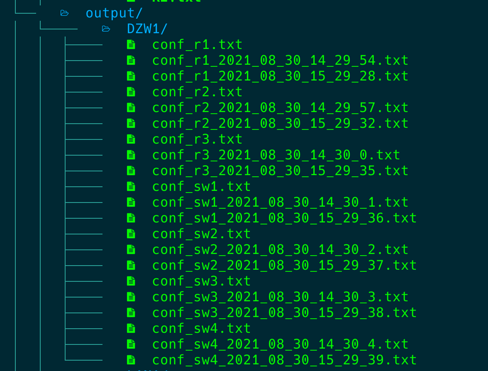

## Get info from Huawei eNSP using python

### Основные возможности: 

- Сохранение конфигураций в файл в определенной директории

- Сохранение конфига на самих устройтствах, т.е. запуск на них команды `save`

- Выполнение любой команды не в режие system-view

- Выводить можно со всех устройств или указать конкретные устройства


### Основные опции при запуске:

- -i IP - адрес хоста, где установлен eNSP
- -n NUM Общее кол-во устройств на схеме(без PC)
- -r LIST Можно ограничить к каким устройствам подключаться. В виде списка, например `1,2,3`
- -c CMD - команда, которую нужно выполнить на устройствах
- -s  сохранить конфиги всех устройств локально на компьютере
- -d SAVEDIR  поддиректория в директории output, где необходимо сохранить конфиги. 
- -w сохранить конфигурации на устройствах, выполнив на них команду `save`
- -p порт первого устройства. Скрипт подключается по умолчанию начиная с 2000 порта, т.е. первое устройство обычно имеет порт 2000, следующее устройство порт 2001 и так далее. Если устройства не начинаются с порта 2000, то нужно указать  здесь с какого порта начинаются. 


### Примеры:

#### Пример 1

Запустить команду  `dis ip int br` на удаленных устройстваx, не на всех только на 1 и 2.  Всего на схеме 7 устройств, но мне нужно выполнить команду только на 1 и 2.

```
cli_ensp.py -i 192.168.180.55 -n 7 -r 1,2 -c "dis ip int br"
```

 

#### Пример 2

Сохранить все конфигурации локально в txt файлах, формат имя устройства + время в директории  output/DZW1

```
cli_ensp.py -i 192.168.180.55 -n 7 -d DZW1 -s 
```





#### Пример 3

Записать конфигурации на всех устройствах во flash

```
cli_ensp.py -i 192.168.180.55 -n 7 -w
```


#### Пример 4

Можно комбинировать, записать конфигурации на всех устройствах во flash и выполнить команду

```
cli_ensp.py -i 192.168.180.55 -n 7 -w -с "dis current"
```


